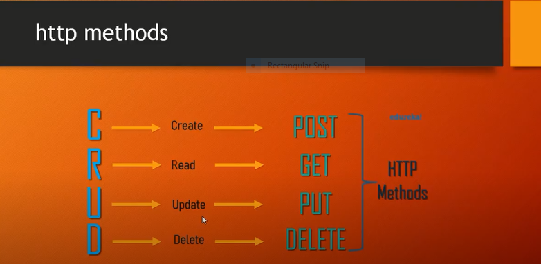

## express server runnig  
```
const express = require('express');
const app = express();
const PORT = 3000;
//server listen
app.listen(PORT, ()=>{
    console.log(`server is runnig at http://localhost:${PORT}`)
})

"start": "nodemon index.js"
```
  


<hr>

### response json data, redirect  
```
router.get("/resister",(req,res)=>{
  /*   res.status(200).json({
        "name":"anisul",
        "message":"i am resister",
        statusCode:200,
        }) */

   /*  res.send("i'm get resister requiest");
    res.end(); */

    res.redirect("/login")
});
```
### response html file  
```
//home route
app.get("/",(req,res)=>{
    // res.send("i'm home page")
    res.statusCode=200;
    res.sendFile(__dirname+"/views/index.html")
})
app.get("/contact",(req,res)=>{
    // res.send("i'm contact page")
    res.statusCode=200;
    res.sendFile(__dirname+"/views/contact.html")
})

// wrong url message 
app.use((req,res)=>{
    res.sendFile(__dirname+"/views/err.html")
})

```

### query with parameter  
```
app.get("/",(req,res)=>{
    // res.send("im home")
    const id = req.query.id;
    res.send(`student id is ${id}`)
})
```
### Route with parameter  
```
app.get("/userId/:id/age/:age",(req,res)=>{
    // res.send("im home")
    const id = req.params.id;
    const age = req.params.age;
    res.send(`student id is ${id} and ${age}`)
})
```
### requist with header  

```
app.get("/",(req,res)=>{
    // res.send("im home")
    const id = req.header('id');
    const name = req.header('name');
    res.send(`student id is ${id} and name ${name}`)
})

```

## body parser  
### requiest with json  

```
// requist with json data / form data parameter 
const bodyParser = require("body-parser");
app.use(bodyParser.urlencoded({ extended: false }));
app.use(bodyParser.json());

app.post("/user",(req,res)=>{
 const name = req.body.name;
 const age = req.body.age;
 res.send(`student name is ${name} and age is ${age}`)
})


```

### form data from fornt end to server then res  
```
//html
 <h1>resister form</h1>
    <form action="/register" method="POST">
    <div>
        <label for="fullName">Full Name</label>
        <input type="text" name="fullName" id="fullName">
    </div>
    <div>
        <label for="age">age</label>
        <input type="text" name="age" id="age">
    </div>
    <button type="submit">submit</button>
    </form>


//js
// requist post form data parameter 
const bodyParser = require("body-parser");
app.use(bodyParser.urlencoded({ extended: false }));
app.use(bodyParser.json());

app.get("/register",(req,res)=>{
   res.sendFile(__dirname+"/index.html") 
})

app.post("/register",(req,res)=>{
   const fullName = req.body.fullName;
   const age = req.body.age;
res.send(`<h2>my name is ${fullName} and age${age}</h2>`) 

})

```